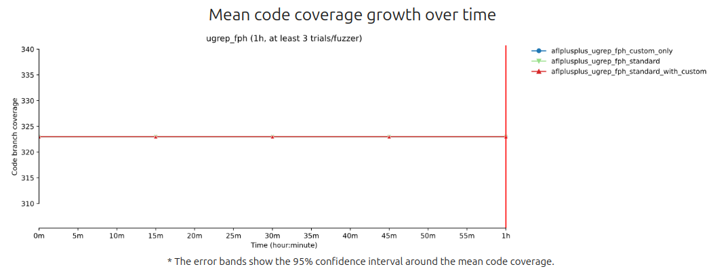
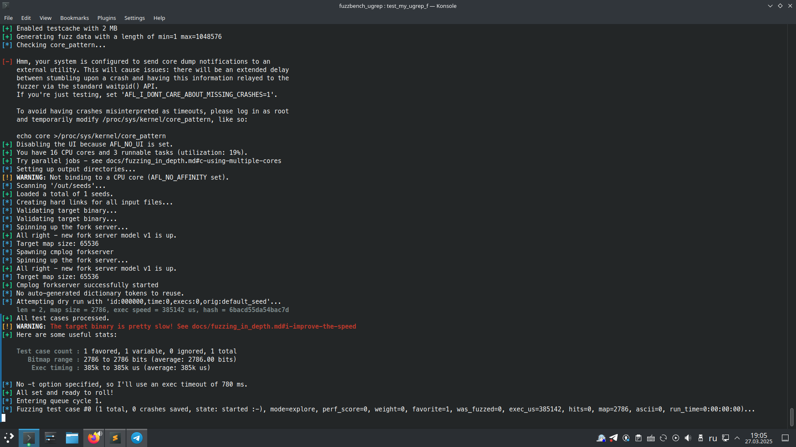
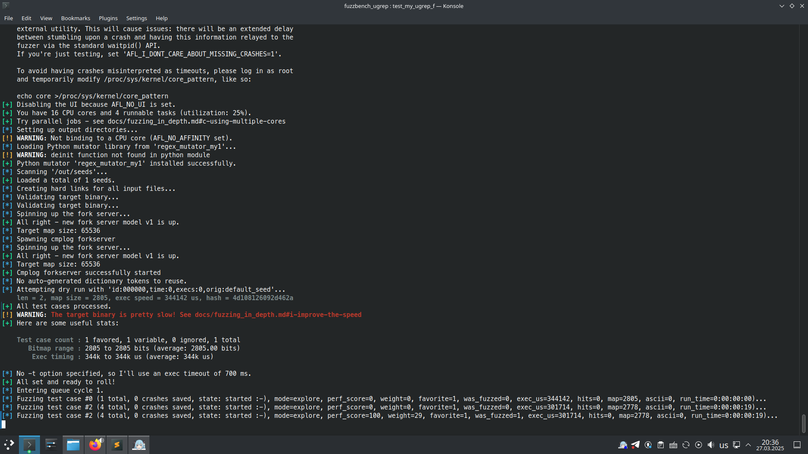

# How I Fuzzed `ugrep`

In case you would like to study the fuzzbench's README, procede here: [README_fuzzbench.md](README_fuzzbench.md)

## Installation Problems

See issue: [https://github.com/google/fuzzbench/issues/940](https://github.com/google/fuzzbench/issues/940)  
Maybe installing an older version of Python fixed it:  
[https://askubuntu.com/a/682875](https://askubuntu.com/a/682875)

## To Get the Commit Time and Hash

```bash
git --no-pager log -1 $COMMIT_HASH --format=%cd --date=iso-strict
git log
```

## How to Check

```bash
make format
make presubmit

./test_my_ugrep_fuzzer_standart_only.sh
./test_my_ugrep_fuzzer_standart_with_custom.sh
./test_my_ugrep_fuzzer_custom_only.sh
```

Local experiment:

```bash
sudo ./run_fph_ugrep_local_experiment.sh # TODO: Remove sudo
sudo chown -R fph results
```

## Screenshots



### Standard



### Standard + Custom Mutator

Almost the same as **Custom Mutator Only**

### Custom Mutator Only




```
ERROR:root:Executed command: "make -j build-aflplusplus-ugrep_fph" returned: 2. Extras: {'output': 'skip();extern \\"C\\" void __afl_coverage_on();extern \\"C\\" void __afl_coverage_off();" "-D__AFL_COVERAGE_START_OFF()=int __afl_selective_coverage_start_off = 1;" -D__AFL_COVERAGE_ON()=__afl_coverage_on() -D__AFL_COVERAGE_OFF()=__afl_coverage_off() -D__AFL_COVERAGE_DISCARD()=__afl_coverage_discard() -D__AFL_COVERAGE_SKIP()=__afl_coverage_skip() -D__AFL_HAVE_MANUAL_CONTROL=1 "-D__AFL_FUZZ_INIT()=int __afl_sharedmem_fuzzing = 1;extern __attribute__((visibility(\\"default\\"))) unsigned int *__afl_fuzz_len;extern __attribute__((visibility(\\"default\\"))) unsigned char *__afl_fuzz_ptr;unsigned char __afl_fuzz_alt[1048576];unsigned char *__afl_fuzz_alt_ptr = __afl_fuzz_alt;" "-D__AFL_FUZZ_TESTCASE_BUF=(__afl_fuzz_ptr ? __afl_fuzz_ptr : __afl_fuzz_alt_ptr)" "-D__AFL_FUZZ_TESTCASE_LEN=(__afl_fuzz_ptr ? *__afl_fuzz_len : (*__afl_fuzz_len = read(0, __afl_fuzz_alt_ptr, 1048576)) == 0xffffffff ? 0 : *__afl_fuzz_len)" "-D__AFL_LOOP(_A)=({ static volatile const char *_B __attribute__((used,unused));  _B = (const char*)\\"##SIG_AFL_PERSISTENT##\\"; extern __attribute__((visibility(\\"default\\"))) int __afl_connected;__attribute__((visibility(\\"default\\"))) int _L(unsigned int) __asm__(\\"__afl_persistent_loop\\"); _L(__afl_connected ? _A : 1); })" "-D__AFL_INIT()=do { static volatile const char *_A __attribute__((used,unused));  _A = (const char*)\\"##SIG_AFL_DEFER_FORKSRV##\\"; __attribute__((visibility(\\"default\\"))) void _I(void) __asm__(\\"__afl_manual_init\\"); _I(); } while (0)"\n#18 31.82 1.\t<eof> parser at end of file\n#18 31.82 2.\tCode generation\n#18 31.82 3.\tRunning pass \'Function Pass Manager\' on module \'simd_avx512bw.cpp\'.\n#18 31.82 4.\tRunning pass \'X86 DAG->DAG Instruction Selection\' on function \'@_ZN6reflex21simd_nlcount_avx512bwERPKcS1_\'\n#18 31.86 mv -f .deps/libreflex_a-letter_scripts.Tpo .deps/libreflex_a-letter_scripts.Po\n#18 32.70 mv -f .deps/libreflex_a-unicode.Tpo .deps/libreflex_a-unicode.Po\n#18 32.72 mv -f .deps/libreflex_a-posix.Tpo .deps/libreflex_a-posix.Po\n#18 32.76 mv -f .deps/libreflex_a-input.Tpo .deps/libreflex_a-input.Po\n#18 32.78  #0 0x000000000190f863 llvm::sys::PrintStackTrace(llvm::raw_ostream&, int) (/usr/local/bin/clang+++0x190f863)\n#18 32.78  #1 0x000000000190d7ae llvm::sys::RunSignalHandlers() (/usr/local/bin/clang+++0x190d7ae)\n#18 32.78  #2 0x000000000190ed0d llvm::sys::CleanupOnSignal(unsigned long) (/usr/local/bin/clang+++0x190ed0d)\n#18 32.78  #3 0x0000000001892e2a (anonymous namespace)::CrashRecoveryContextImpl::HandleCrash(int, unsigned long) CrashRecoveryContext.cpp:0:0\n#18 32.78  #4 0x0000000001892dcb (/usr/local/bin/clang+++0x1892dcb)\n#18 32.78  #5 0x000000000190a2b7 llvm::sys::Process::Exit(int, bool) (/usr/local/bin/clang+++0x190a2b7)\n#18 32.78  #6 0x0000000000963732 (/usr/local/bin/clang+++0x963732)\n#18 32.78  #7 0x0000000001896931 llvm::report_fatal_error(llvm::Twine const&, bool) (/usr/local/bin/clang+++0x1896931)\n#18 32.78  #8 0x00000000025c0591 (/usr/local/bin/clang+++0x25c0591)\n#18 32.78  #9 0x00000000025bfaed (/usr/local/bin/clang+++0x25bfaed)\n#18 32.78 #10 0x0000000000a0560d (anonymous namespace)::X86DAGToDAGISel::Select(llvm::SDNode*) X86ISelDAGToDAG.cpp:0:0\n#18 32.78 #11 0x00000000025b8a7f llvm::SelectionDAGISel::DoInstructionSelection() (/usr/local/bin/clang+++0x25b8a7f)\n#18 32.78 #12 0x00000000025b8130 llvm::SelectionDAGISel::CodeGenAndEmitDAG() (/usr/local/bin/clang+++0x25b8130)\n#18 32.78 #13 0x00000000025b73bf llvm::SelectionDAGISel::SelectAllBasicBlocks(llvm::Function const&) (/usr/local/bin/clang+++0x25b73bf)\n#18 32.78 #14 0x00000000025b5137 llvm::SelectionDAGISel::runOnMachineFunction(llvm::MachineFunction&) (/usr/local/bin/clang+++0x25b5137)\n#18 32.78 #15 0x00000000009fc5ad (anonymous namespace)::X86DAGToDAGISel::runOnMachineFunction(llvm::MachineFunction&) X86ISelDAGToDAG.cpp:0:0\n#18 32.78 #16 0x0000000000ee30de llvm::MachineFunctionPass::runOnFunction(llvm::Function&) (/usr/local/bin/clang+++0xee30de)\n#18 32.78 #17 0x00000000012e88cd llvm::FPPassManager::runOnFunction(llvm::Function&) (/usr/local/bin/clang+++0x12e88cd)\n#18 32.78 #18 0x00000000012efad3 llvm::FPPassManager::runOnModule(llvm::Module&) (/usr/local/bin/clang+++0x12efad3)\n#18 32.78 #19 0x00000000012e9460 llvm::legacy::PassManagerImpl::run(llvm::Module&) (/usr/local/bin/clang+++0x12e9460)\n#18 32.78 #20 0x0000000001b59553 clang::EmitBackendOutput(clang::DiagnosticsEngine&, clang::HeaderSearchOptions const&, clang::CodeGenOptions const&, clang::TargetOptions const&, clang::LangOptions const&, llvm::StringRef, llvm::Module*, clang::BackendAction, std::unique_ptr<llvm::raw_pwrite_stream, std::default_delete<llvm::raw_pwrite_stream> >) (/usr/local/bin/clang+++0x1b59553)\n#18 32.78 #21 0x000000000269f731 clang::BackendConsumer::HandleTranslationUnit(clang::ASTContext&) (/usr/local/bin/clang+++0x269f731)\n#18 32.78 #22 0x00000000030f6134 clang::ParseAST(clang::Sema&, bool, bool) (/usr/local/bin/clang+++0x30f6134)\n#18 32.78 #23 0x00000000021635f9 clang::FrontendAction::Execute() (/usr/local/bin/clang+++0x21635f9)\n#18 32.78 #24 0x00000000020e0246 clang::CompilerInstance::ExecuteAction(clang::FrontendAction&) (/usr/local/bin/clang+++0x20e0246)\n#18 32.78 #25 0x0000000002213bbb clang::ExecuteCompilerInvocation(clang::CompilerInstance*) (/usr/local/bin/clang+++0x2213bbb)\n#18 32.78 #26 0x0000000000963405 cc1_main(llvm::ArrayRef<char const*>, char const*, void*) (/usr/local/bin/clang+++0x963405)\n#18 32.78 #27 0x00000000009618ab ExecuteCC1Tool(llvm::SmallVectorImpl<char const*>&) driver.cpp:0:0\n#18 32.78 #28 0x0000000001f7ffa2 void llvm::function_ref<void ()>::callback_fn<clang::driver::CC1Command::Execute(llvm::ArrayRef<llvm::Optional<llvm::StringRef> >, std::__cxx11::basic_string<char, std::char_traits<char>, std::allocator<char> >*, bool*) const::$_1>(long) Job.cpp:0:0\n#18 32.78 #29 0x0000000001892dad llvm::CrashRecoveryContext::RunSafely(llvm::function_ref<void ()>) (/usr/local/bin/clang+++0x1892dad)\n#18 32.78 #30 0x0000000001f7fae5 clang::driver::CC1Command::Execute(llvm::ArrayRef<llvm::Optional<llvm::StringRef> >, std::__cxx11::basic_string<char, std::char_traits<char>, std::allocator<char> >*, bool*) const (/usr/local/bin/clang+++0x1f7fae5)\n#18 32.78 #31 0x0000000001f4df8d clang::driver::Compilation::ExecuteCommand(clang::driver::Command const&, clang::driver::Command const*&) const (/usr/local/bin/clang+++0x1f4df8d)\n#18 32.78 #32 0x0000000001f4e1d7 clang::driver::Compilation::ExecuteJobs(clang::driver::JobList const&, llvm::SmallVectorImpl<std::pair<int, clang::driver::Command const*> >&) const (/usr/local/bin/clang+++0x1f4e1d7)\n#18 32.78 #33 0x0000000001f65948 clang::driver::Driver::ExecuteCompilation(clang::driver::Compilation&, llvm::SmallVectorImpl<std::pair<int, clang::driver::Command const*> >&) (/usr/local/bin/clang+++0x1f65948)\n#18 32.78 #34 0x000000000096108c main (/usr/local/bin/clang+++0x96108c)\n#18 32.78 #35 0x00007fa6cb2c4083 __libc_start_main (/lib/x86_64-linux-gnu/libc.so.6+0x24083)\n#18 32.78 #36 0x000000000095e74e _start (/usr/local/bin/clang+++0x95e74e)\n#18 32.78 clang-15: error: clang frontend command failed with exit code 70 (use -v to see invocation)\n#18 32.78 clang version 15.0.0 (https://github.com/llvm/llvm-project.git bf7f8d6fa6f460bf0a16ffec319cd71592216bf4)\n#18 32.78 Target: x86_64-unknown-linux-gnu\n#18 32.78 Thread model: posix\n#18 32.78 InstalledDir: /usr/local/bin\n#18 32.99 clang-15: note: diagnostic msg: \n#18 32.99 ********************\n#18 32.99 \n#18 32.99 PLEASE ATTACH THE FOLLOWING FILES TO THE BUG REPORT:\n#18 32.99 Preprocessed source(s) and associated run script(s) are located at:\n#18 32.99 clang-15: note: diagnostic msg: /tmp/simd_avx512bw-ef3374.cpp\n#18 33.00 clang-15: note: diagnostic msg: /tmp/simd_avx512bw-ef3374.sh\n#18 33.00 clang-15: note: diagnostic msg: \n#18 33.00 \n#18 33.00 ********************\n#18 33.04 make[2]: *** [Makefile:643: libreflex_a-simd_avx512bw.o] Error 70\n#18 33.04 make[2]: *** Waiting for unfinished jobs....\n#18 33.24 mv -f .deps/libreflex_a-block_scripts.Tpo .deps/libreflex_a-block_scripts.Po\n#18 33.27 mv -f .deps/libreflex_a-utf8.Tpo .deps/libreflex_a-utf8.Po\n#18 33.39 mv -f .deps/libreflex_a-language_scripts.Tpo .deps/libreflex_a-language_scripts.Po\n#18 36.14 mv -f .deps/libreflex_a-matcher_avx512bw.Tpo .deps/libreflex_a-matcher_avx512bw.Po\n#18 36.56 mv -f .deps/libreflex_a-composer.Tpo .deps/libreflex_a-composer.Po\n#18 40.87 mv -f .deps/libreflex_a-matcher_avx2.Tpo .deps/libreflex_a-matcher_avx2.Po\n#18 45.35 mv -f .deps/libreflex_a-matcher.Tpo .deps/libreflex_a-matcher.Po\n#18 48.89 mv -f .deps/libreflex_a-convert.Tpo .deps/libreflex_a-convert.Po\n#18 84.75 mv -f .deps/libreflex_a-pattern.Tpo .deps/libreflex_a-pattern.Po\n#18 84.76 make[2]: Leaving directory \'/src/ugrep/lib\'\n#18 84.77 make[1]: *** [Makefile:567: all-recursive] Error 1\n#18 84.77 make[1]: Leaving directory \'/src/ugrep\'\n#18 84.77 make: *** [Makefile:404: all] Error 2\n#18 84.77 Failed to build ugrep: please run the following two commands:\n#18 84.77 $ autoreconf -fi\n#18 84.77 $ ./build.sh\n#18 84.77 \n#18 84.77 If that does not work, please open an issue at:\n#18 84.77 https://github.com/Genivia/ugrep/issues\n#18 86.20 Traceback (most recent call last):\n#18 86.20   File "<string>", line 1, in <module>\n#18 86.20   File "/src/fuzzers/aflplusplus/fuzzer.py", line 178, in build\n#18 86.20     utils.build_benchmark()\n#18 86.20   File "/src/fuzzers/utils.py", line 81, in build_benchmark\n#18 86.20     subprocess.check_call([\'/bin/bash\', \'-ex\', build_script], env=env)\n#18 86.20   File "/usr/local/lib/python3.10/subprocess.py", line 369, in check_call\n#18 86.20     raise CalledProcessError(retcode, cmd)\n#18 86.20 subprocess.CalledProcessError: Command \'[\'/bin/bash\', \'-ex\', \'/src/build.sh\']\' returned non-zero exit status 1.\n#18    completed: 2025-03-28 16:55:38.609537046 +0000 UTC\n#18     duration: 1m26.487153487s\n#18        error: "process \\"/bin/sh -c echo \\\\\\"Run fuzzer_build to build the target\\\\\\" && if [ -z \\\\\\"$debug_builder\\\\\\" ] ; then fuzzer_build; fi\\" did not complete successfully: exit code: 1"\n\nprocess "/bin/sh -c echo \\"Run fuzzer_build to build the target\\" && if [ -z \\"$debug_builder\\" ] ; then fuzzer_build; fi" did not complete successfully: exit code: 1\nmake: *** [docker/generated.mk:64631: .aflplusplus-ugrep_fph-builder] Error 1\n'}
ERROR:root:Failed to build benchmark: ugrep_fph, fuzzer: aflplusplus. Extras: {'traceback': 'Traceback (most recent call last):\n  File "/work/src/experiment/build/builder.py", line 174, in build_fuzzer_benchmark\n    buildlib.build_fuzzer_benchmark(fuzzer, benchmark)\n  File "/work/src/experiment/build/local_build.py", line 87, in build_fuzzer_benchmark\n    make([image_name])\n  File "/work/src/experiment/build/local_build.py", line 33, in make\n    return new_process.execute(command, cwd=utils.ROOT_DIR)\n  File "/work/src/common/new_process.py", line 125, in execute\n    raise subprocess.CalledProcessError(retcode, command)\nsubprocess.CalledProcessError: Command \'[\'make\', \'-j\', \'build-aflplusplus-ugrep_fph\']\' returned non-zero exit status 2.\n'}
```

--> --disable-avx2 for ugrep
